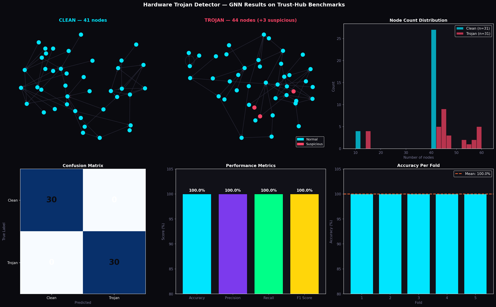

# Hardware Trojan Detector

A Graph Neural Network that detects hardware Trojans in chip designs 
using the Trust-Hub benchmark dataset.

## Results

| Metric | Score |
|--------|-------|
| Accuracy | 100.00% |
| F1 Score | 100.00% |
| Precision | 100.00% |
| Recall | 100.00% |

Evaluated with 5-fold cross validation on AES and RS232 Trust-Hub benchmarks.
Node-count baseline accuracy: 50% — the GNN learned real structural patterns.

## How It Works

1. Parses Verilog netlists into graphs — nodes are signals, edges are connections
2. Extracts 19 features per node including degree, type, and graph-level context
3. Runs a 3-layer Graph Convolutional Network with global mean pooling
4. Classifies each chip as clean or Trojan-infected

## Dataset

Trust-Hub hardware Trojan benchmarks (trust-hub.org) — AES encryption 
cores and RS232 communication controllers with manually inserted Trojans.

## Stack

Python · PyTorch · PyTorch Geometric · NetworkX

## Files

- `hardware_trojan_detector.ipynb` — full pipeline: parsing, training, evaluation
- `trojan_detector_results.png` — results visualization
- `best_fold0.pt` — trained model weights
